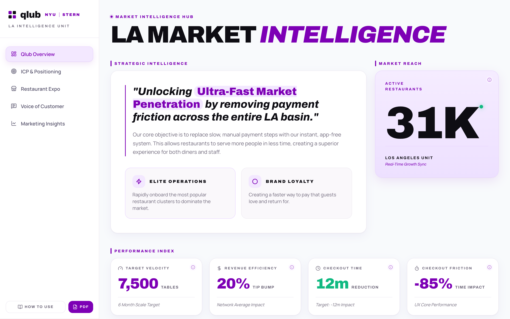
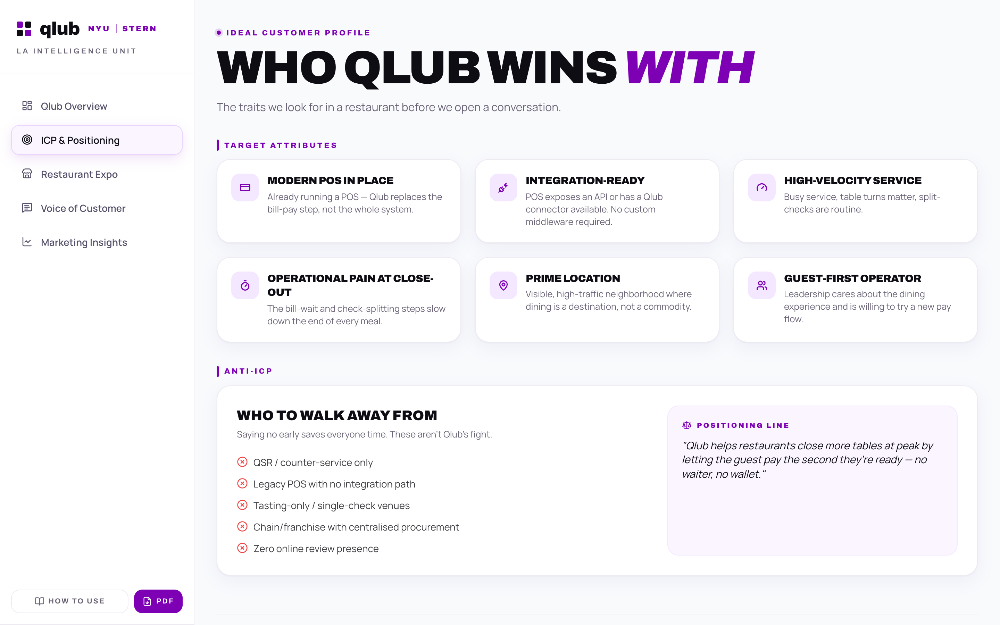
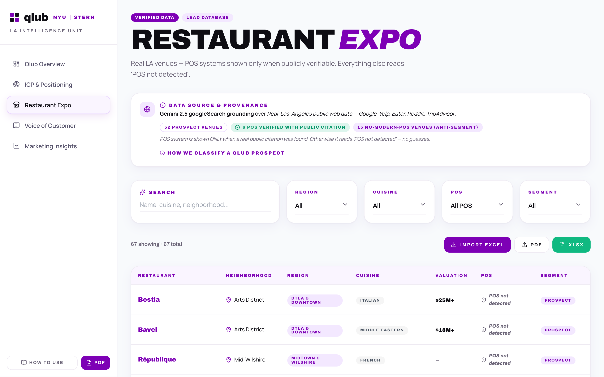
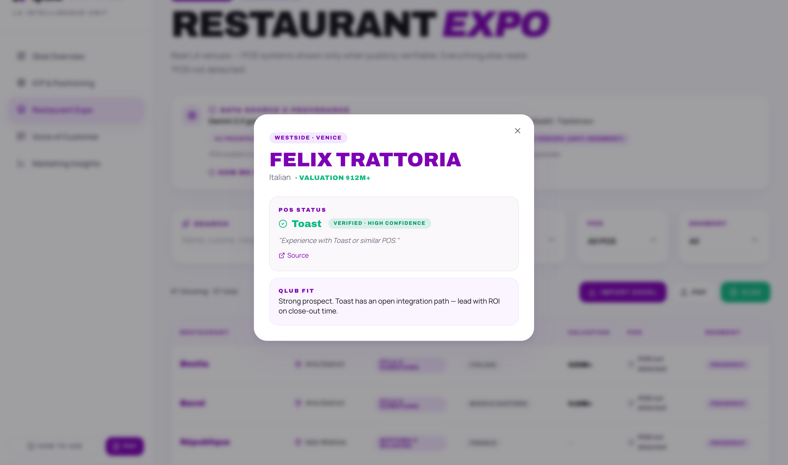
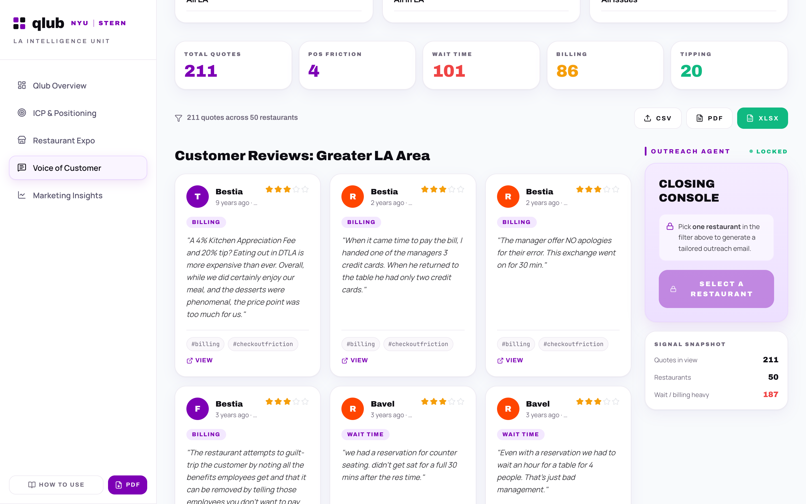
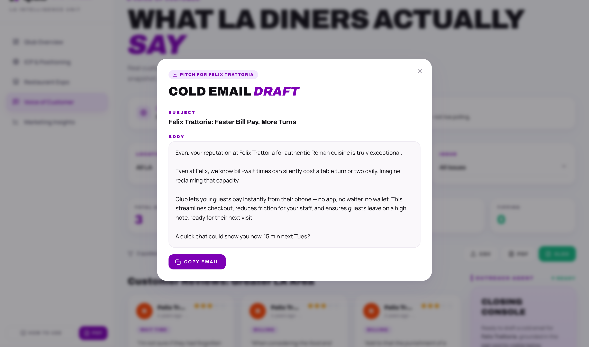
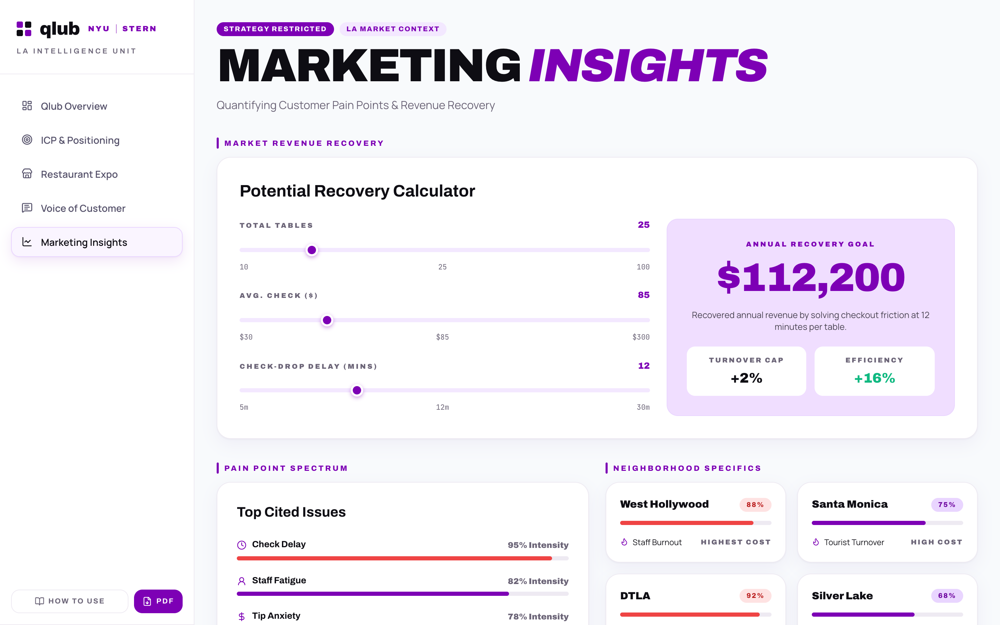

# Qlub · LA Market Intelligence

[](https://react.dev)
[](https://tailwindcss.com)
[](https://ai.google.dev)

Go-to-market intelligence dashboard for Qlub's Los Angeles launch. Turns a cold restaurant name into a qualified, evidence-backed, ready-to-send sales email in under 60 seconds — qualifies the venue against a 3-rule ICP, surfaces cited diner complaints about checkout friction, drafts a grounded outreach email, and quantifies the revenue Qlub recovers.

> **Live Demo**: **[studio-to-emergent.preview.emergentagent.com](https://studio-to-emergent.preview.emergentagent.com)**
> Click **Login** ¬> open **Voice of Customer** ¬> pick a restaurant ¬> click **Generate Outreach**

---

## What it does

**Qualify** 67 real LA venues against a strict 3-rule prospect test (full-service · integrable POS · public close-out pain), split into 52 Qlub Prospects and 15 Anti-Segment cash-only venues.
*Why it matters: SDRs waste most of their first calls on venues that can never buy. A hard ICP + Anti-ICP list means the team only dials restaurants Qlub can actually integrate with.*

**Verify** POS systems only when a real public citation exists — otherwise the venue reads **"POS not detected"**. Every verified POS carries a confidence label, the evidence quote, and a source link.
*Why it matters: guessed firmographics are the most common failure of lead databases. This one refuses to invent a POS, so an SDR never opens a call with a wrong assumption.*

**Listen** to 211 real, cited diner quotes across 50 restaurants, tagged into 4 friction categories — POS Friction, Wait Time, Billing, Tipping — with nested Location → Restaurant → Issue filters.
*Why it matters: "your guests hate waiting for the check" is a claim; a dated Reddit quote about *their* restaurant is proof. Every quote links back to its source.*

**Pitch** with an AI Outreach Agent (the *Closing Console*) that drafts a subject line + ~120-word cold email grounded in the selected venue's own pain points.
*Why it matters: the console stays **locked** until you narrow to one restaurant, so the model can only write from real, venue-specific evidence — never a generic template.*

**Quantify** the opportunity with a live Revenue Recovery Calculator (tables √ó avg. check √ó check-drop delay ‚Üí annual recovered revenue).
*Why it matters: turns a UX pain point into a dollar number an owner will take a meeting for — e.g. **$112,200/yr** at 25 tables, $85 check, 12-minute delay.*

**Bring your own data** — drop in an `.xlsx / .xls / .csv` lead list and the whole table, filter set, and export pipeline re-runs on your rows. Export any view as **PDF, XLSX, or CSV**.
*Why it matters: the dashboard doesn't lock the team into one research sprint — past spreadsheets become first-class data instantly.*

---

## Methodology

### Research pipeline (public web ‚Üí cited dataset)

```
Venue seed list        [Manual]           — 67 LA venues across 9 regions
   ‚Üì
POS verification       [Gemini 2.5]       — googleSearch grounding; POS kept ONLY with a public citation
   ‚Üì
Review harvesting      [Gemini 2.5]       — Google · Yelp · Eater · Reddit · TripAdvisor
   ‚Üì
Issue tagging          [Rule-based]       — POS Friction / Wait Time / Billing / Tipping
   ‚Üì
Static snapshot        [API]              — frozen, auditable, every quote carries source_url + date
```

The dataset is a **static snapshot, not live polling** — deliberately. A frozen, cited corpus is reproducible and auditable, and the sales team sees the same evidence every time they open a venue.

### 3-rule prospect qualification

A venue is a **Qlub Prospect** only when it meets **all three**:

1. **Sit-down / full-service** — Qlub is a pay-at-table product
2. **Modern POS with an integration path** (Toast, Micros, Square, Clover, Aloha, TouchBistro) — *or* POS unverified but the format fits, so an SDR can confirm in a 2-minute call
3. **≥ 1 public close-out / billing / wait-time pain point** — the exact friction Qlub removes

Cash-only, food-truck, and pop-up venues are marked **Anti-Segment** — there is no POS to integrate with.

### Outreach agent (one venue ‚Üí grounded email)

```
Location filter        [UI]               — e.g. Westside
   ‚Üì
Restaurant filter      [UI]               — Closing Console flips LOCKED → READY
   ‚Üì
Pain-point context     [API]              — that venue's cited quotes + issue tags
   ‚Üì
Email draft            [Gemini]           — subject + ~120-word body, tone: confident-friendly
   ‚Üì
Copy Email             [UI]               — paste into Gmail / Outreach / Apollo
```

The lock-until-one-venue design is the grounding guarantee: the model only ever sees one restaurant's real evidence, so it cannot hallucinate a complaint that doesn't exist.

### Revenue recovery model

```
extra turns / table / day = (check-drop delay √∑ 60) √ó 0.8
annual recovery           = tables √ó extra turns √ó avg. check √ó 330 service days
```

Deliberately napkin math — transparent enough for an owner to check on the spot, and tuned conservatively (80% utilisation of recovered minutes, 330 operating days).

---

## Architecture

```
┌─────────────────────────────────────────────────────────────────┐
│                     REACT DASHBOARD                              │
│  Overview · ICP & Positioning · Restaurant Expo ·                │
│  Voice of Customer · Marketing Insights                          │
└─────────┬───────────────────────────────────────────────────────┘
          ‚Üì
┌─────────────────────────────────────────────────────────────────┐
│                     CLIENT-SIDE ENGINES                          │
│   Filtering & search   │   Excel import (SheetJS)               │
│   Recovery calculator  │   PDF / XLSX / CSV export (jsPDF)      │
└─────────┬───────────────────────────────────────────────────────┘
          ‚Üì
┌─────────────────────────────────────────────────────────────────┐
│                     REST API  (/api)                             │
│   /restaurants · /neighborhoods · /expo/restaurants              │
│   /voc-static/filters · /voc-static/reviews · /outreach/generate │
└─────────┬───────────────────────────────────────────────────────┘
          ‚Üì
┌─────────────────────────────────────────────────────────────────┐
│   CITED DATA SNAPSHOT         │   LLM (Google Gemini)            │
│   67 venues · 211 quotes      │   googleSearch grounding (data)  │
│   POS evidence URLs           │   Outreach email generation      │
└───────────────────────────────┴──────────────────────────────────┘
```

---

## File structure

```
qlub-la-intelligence/
├── frontend/
│   ├── public/
│   │   └── how-to-use.html          # 10-step product walkthrough
│   └── src/
│       ├── App.js                   # Router + dashboard shell + exports
│       ├── components/
│       │   ├── Login.jsx            # Welcome / entry screen
│       │   ├── Sidebar.jsx          # Navigation + How to Use + PDF
│       │   ├── LADensityMap.jsx     # Neighborhood density map
│       │   ├── PageHeader.jsx       # Shared page header + chips
│       │   ├── Tooltip.jsx          # (i) metric explainers
│       │   ├── QlubLogo.jsx
│       │   └── ui/                  # shadcn/ui primitives
│       ├── pages/
│       │   ├── Overview.jsx         # Thesis · Market Reach · KPIs · density
│       │   ├── ICP.jsx              # Target attributes + Anti-ICP
│       │   ├── RestaurantExpo.jsx   # Lead DB · filters · import · detail modal
│       │   ├── VoiceOfCustomer.jsx  # Cited quotes + Outreach Agent
│       │   └── MarketingInsights.jsx# Recovery calculator + pain spectrum
│       └── lib/
│           ├── api.js               # REST client
│           └── utils.js
└── README.md
```

---

## Metrics

### Dataset

| Metric | Value |
|---|---|
| Venues tracked | **67** |
| Qlub Prospects | **52** |
| Anti-Segment (cash / no modern POS) | 15 |
| POS verified with public citation | **6** |
| LA neighborhoods mapped | 23 |
| Regions | 9 |

### Voice of Customer

| Metric | Value |
|---|---|
| Cited diner quotes | **211** |
| Restaurants covered | 50 |
| Wait Time quotes | 101 |
| Billing quotes | 86 |
| Tipping quotes | 20 |
| POS Friction quotes | 4 |
| Sources | Google · Yelp · Eater · Reddit · TripAdvisor · press |

### GTM targets (Overview)

| KPI | Target |
|---|---|
| Addressable LA restaurants | **31K** |
| 6-month table target | 7,500 |
| Average tip bump | +20% |
| Checkout time saved | ‚àí12 min |
| Checkout friction reduction | ‚àí85% |

### Workflow speed

| Task | Time |
|---|---|
| Cold venue ‚Üí grounded email | **< 60s** |
| Outreach generation | ~5–15s |
| Excel import ‚Üí filtered table | instant (client-side) |

---

## Tech stack

**Frontend**: React · Tailwind CSS · shadcn/ui (Radix) · Framer Motion · Lucide icons
**Data I/O**: SheetJS (`xlsx`) import/export · jsPDF + jsPDF-AutoTable
**AI**: Google Gemini 2.5 — googleSearch grounding for research, generation for outreach
**Deployment**: Emergent

### Why a static, cited snapshot instead of live scraping

Live review polling is slow, rate-limited, and non-reproducible — the same venue can show different evidence minute to minute, and hallucinated citations slip in unnoticed. Freezing a grounded snapshot means every quote has a `source_url` and date, pages load instantly, and the outreach agent is always grounded in evidence a human has been able to audit.

---

## Getting started

### Use the live app
1. Open **[studio-to-emergent.preview.emergentagent.com](https://studio-to-emergent.preview.emergentagent.com)** and click **Login**
2. **Overview** — read the GTM thesis, KPIs, and LA density map (hover any **(i)** for an explanation)
3. **ICP & Positioning** — review who Qlub targets and who to walk away from
4. **Restaurant Expo** — search and filter by Region / Cuisine / POS / Segment; click any row for POS evidence and Qlub fit
5. **Voice of Customer** — pick a Location, then a Restaurant; the Closing Console flips to **READY**
6. Click **Generate Outreach**, then **Copy Email** and paste into Gmail / Outreach / Apollo
7. **Marketing Insights** — move the sliders to model annual revenue recovered

A full 10-step walkthrough is available from **How to Use** in the sidebar.

### Import your own lead list
In **Restaurant Expo**, click **Import Excel** and choose an `.xlsx`, `.xls`, or `.csv` file. Recognized columns (case-insensitive): `Name, Neighborhood, Region, Cuisine, Valuation, POS, Segment`. Click **Clear Import** to return to the LA dataset.

### Export
Every table view exports as **PDF** or **XLSX** (Voice of Customer also exports **CSV**). The sidebar **PDF** button exports an executive summary.

---

## Screenshots

### Overview — LA Market Intelligence Hub


_GTM thesis, 31K market reach, performance index, and LA restaurant density by neighborhood_

### ICP & Positioning


_Six target attributes, a hard Anti-ICP list, and the one-line positioning statement_

### Restaurant Expo — Lead database




_67 venues with Region / Cuisine / POS / Segment filters; detail modal shows POS evidence + Qlub fit verdict_

### Voice of Customer + Outreach Agent




_211 cited quotes with nested filters; the Closing Console drafts a grounded cold email for one venue_

### Marketing Insights


_Revenue Recovery Calculator, pain-point spectrum, and neighborhood-level cost of friction_

---

## Dataset

Real Los Angeles venues and public diner reviews collected via **Gemini 2.5 googleSearch grounding** over Google, Yelp, Eater, Reddit, TripAdvisor, and press coverage. Venues span 23 neighborhoods across 9 regions — from Arts District fine dining to Boyle Heights taco trucks. POS systems are recorded only when a public citation was found; every quote retains its source URL and date. This is a static research snapshot, not live data.


---

<sub>Built for Qlub × NYU Stern · React · Google Gemini · Emergent</sub>
